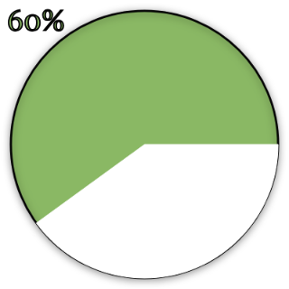
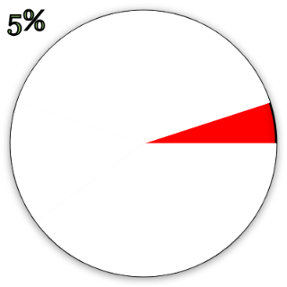
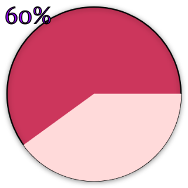
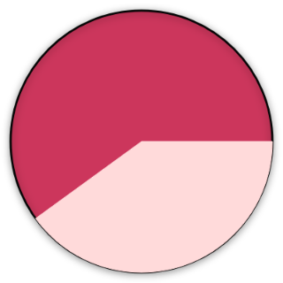

# pie-render
A simple JavaScript library that visualizes remaining percent and used values as a circular pie on a HTML canvas element.

## About
pie-render draws a circular pie on an canvas. The pie gradually shrinks as you add values against a chosen base amount. Unlike traditional pie charts used for static data visualization, pie-render is designed for scenarios where you want to visualize the remaining capacity. This makes it perfect for budgets, storage usage, displaying remaining lives in games, calorie tracking and more.

## Features
- Create a pie, add values and get visual representation of what's remaining.
- Add a value and watch it convert to a slice of the pie.
- Set boundaries and colours for "warning" and "danger" states.
- Customize the appearance to match your style.
- No external libraries needed.

## Usage and Example
The package need a HTML5 canvas element to render the pie on.
Create a canvas element in your HTML

```html
<canvas id="canvasElement" width="240" height="240"></canvas>
```

Import the PieMeter class and collect the canvasElement.

```javascript
import { PieRender } from 'pie-render'

const canvasElement = document.getElementById('canvasElement')

// Create a initial pie with default values.
const pieRender = new PieRender(canvasElement, 200) // Base value of 200

// Customize the pie.
pieRender.setPieBoundaries(60, 30) // Warning at 60%, danger at 30%
pieRender.createSlice(80) // Add a slice of 80 
pieRender.displayPercentageText(true) // Show remaining percentage text
pieRender.setFontColour('#ff0000') // Custom font colour
pieRender.setFontSize(50) // Custom font size
```

### Default pie example




### Custom pie example



## API
import { PieRender } from 'pie-render'

### Constructor
**new PieRender(canvasElement, baseValue)**\
Initialize with a HTML5 canvas element and a base value.
The base value must be a positive number greater than zero.
Draws the initial circle that represents 100% of the base value and the pie.

### Methods
**createSlice(inputValue)**\
Adds a value, coverts it to percent and radians/angles and draws it as a slice on the circle.
Collects and stores the colour and the start and end angle of the slice.
Redraws the pie on the canvas.

**setPieBoundaries(warningPercent, dangerPercent)**\
Set the boundary in percent for when to reach warning and/or danger.
The percent value for when the state will change from "ok" to "warning".
The percent value for when the state will change from "warning" to "danger".
Redraws the pie on the canvas.

**setPieColour(hexColour)**\
Sets the base colour in hex colour code of the pie.
Redraws the pie on the canvas.

**setSliceColour(hexColour)**\
Sets the colour in hex colour code of a created slice that will be represented as a "removed" piece of the pie.
Redraws the pie on the canvas.

**setStateColours(warningColour, dangerColour)**\
Sets the colours in hex colour code for the 'warning' and 'danger' state of the pie.
Redraws the pie on the canvas.

**displayPercentText(display = false)**\
Determines whether to display text on canvas or not. True to display.
Redraws the pie on the canvas.

**setFontColour(hexColour)**\
Sets the colour in hex colour code of the text on the canvas. 
Redraws the pie on the canvas.

**setFontSize(fontSize)**\
Sets the size in px of the text drawn on the canvas. 
Redraws the pie on the canvas.

**getCurrentStateOfPie()**\
Returns an object with the current colour settings, pie boundaries, angles, text settings and remaining values.
Redraws the pie on the canvas.

## Installation
Install the package using npm:

```bash
npm install pie-render
```

## Requirements
This package requires ES6 module and HTML5 support.

## Testing
The package has been continuously tested throughout development by manual tests in a test application.
Further testing is required to ensure the quality of this library.

See [testreport](docs/testrapport.md) for details.

## Versioning
This project uses [Semantic Versioning](https://semver.org/).

## Getting involved
Please read [the Contribution Guide](docs/CONTRIBUTING.md) for instructions on how to contribute to this project.

## Author
Mathilda Segerlund - Web Development student at Linnaeus University, Sweden.

## License
This project is licensed under the MIT License

## Feedback
For further questions, feedback or suggestions, feel free to [e-mail me](mailto:ms228qs@student.lnu.se)!
