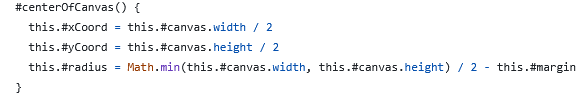
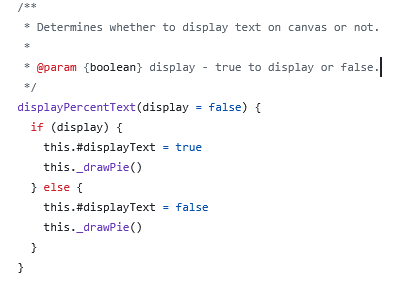
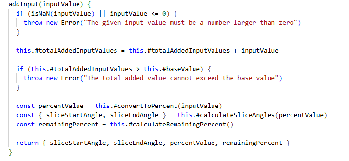
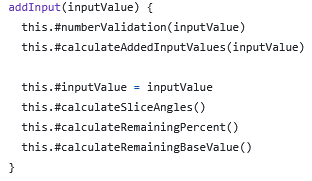
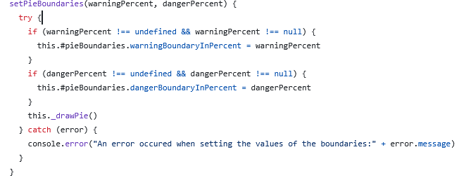
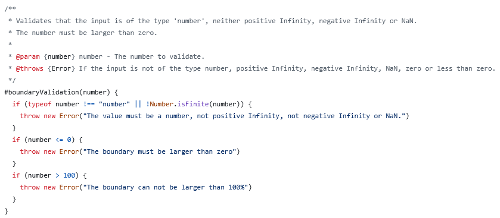

# Reflektion - 1DV610, Laboration 2

## Reflektion kapitel 2 - Namngivning
| Namn | Förklaring | Reflektion |
|------|------------|------------|
| `ConvertInput`, `DrawPie`, `StylePie` | Klassnamn på tre moduler som konverterar användarvärden till procent och vinklar, ritar ”pajen”/cirkeln på canvas och sätter de visuella värdena. | Följer inte regeln att undvika verb i klassnamn **Avoid Verbs in Class Names**. Ändras till substantiv. |
| `set warning(value)` | Metodnamn för metod som sätter värdet för ”varning”, den första gränsen i procent då ”pajen”/cirkeln ska ändra färg. | Metodens namn avslöjar inte särskilt mycket. Ett värde för varning ska sättas, men är det en varnings-status, en gräns i siffror eller färgen som ”pajen”/cirkeln ska ändras till som representerar varning?  För att följa regeln **Add Meaningful Context** väljer jag därför att ändra till `set warningBoundaryInPercent(number)`.  |
| `addPieBoundaries(warningBoundary, dangerBoundary)` | Metodnamn för metod som sätter gränsvärden för ”warning” och ”danger”. | Här väljer jag att byta ord från `add` till `set` för att undvika missförstånd, **Avoid Disinformation**. Det är inte värden som kommer att adderas vilket man skulle kunna tro, utan här *sätter* man värden för ”warning” och ”danger”. Utan kommentaren till metoden skulle man dessutom inte förstå att gränsvärdena ska anges i procent, vilket bryter mot **Use Intention-Revealing Names**. Trots att namnet blir längre väljer jag att lägga till `percent` i parameternamnen för tydlighetens skull `setPieBoundaries(warningPercent, dangerPercent)`. |
| `addSliceColour(colour)` | Metodnamn för metod som sätter färgen på ”pajen”/cirkeln. | Även här ändrar jag från `add` till `set` för att undvika missförstånd **Avoid Desinformation** och följa **One Word Per Concept**. Alla metoder som sätter värden börjar med `set`. |
| `getPieInfo()` | Returnerar information om ”pajens” status (valda färger, gränsvärden,  återstående procent) | Ordet ”Info” säger egentligen inte vad som returneras och kan räknas som ett brusord, vilket bryter mot **Make Meaningful Distinctions**. Därför ändrar jag till `getCurrentStateOfPie()` för att tydligare visa att det är nuvarande tillstånd som returneras. |

Jag försökte tänka på min namngivning redan innan jag påbörjade kodandet. Trots detta blev jag ändå tvungen att refaktorera många av mina metoder efter att ha läst kapitel 2.

Jag har främst fokuserat på att uppfylla bokens krav kring **Use Intention-Revealing Names**, vilket innebär att metodnamn bland annat ska spegla vad de faktiskt gör. En större refaktorering som jag gjorde var därför bland annat att ändra alla metoder som tidigare hade namn som började på ”add” till ”set”. Metoderna adderade inte till något som man skulle kunna tro, utan *sätter* ett nytt värde.

Mina metodnamn är nu tydligare och förklarar både syfte och funktion. När jag har refaktorerat mina namn har jag dock inte lyckats göra dessa kortare, utan snarare längre för att var mer självförklarande. Här känns det som att det kan krocka lite mellan läsbarhet och förståelse. Jag tycker dock inte att långa namn gör något i min kod, då det har bidragit till att lättare förstå helheten av min modul. Jag vill trots det behålla mina JSDoc kommentarer till alla metoder. Personligen uppskattar jag dessa när jag läser någon annans kod och tycker inte att detta påverkar min läsbarhet negativt.

En annan upptäckt som ställde till problem i min kod var en varierande stavning av ordet färg på engelska, color/colour. Här upptäckte jag vikten av att vara konsekvent i språket.

Jag har försökt att vara noggrann under granskningen av min kod och tycker att jag nu följer många viktiga regler, som att använda namn som går att uttala och söka efter, som inte kräver någon mental mapping och använder inte ord som kan uppfattas som ”cute”, utan försöker använda etablerade begrepp där det går. Ibland kan jag nog närma mig "cute", men det är för att jag vill att min kod ska vara unik. Författaren nämner att målet är att bli förstådd och att använda pocketboks-modellen, vilket jag tycket är en bra liknelse att förhålla sig till.

Men, för varje gång jag läser min kod tycker jag att jag upptäcker något nytt som kan förbättras i min namngivning. När kan man känna sig nöjd? 
Jag förstår hur till och med små justeringar kan göra stor skillnad för både läsbarheten och förståelsen. En välfungerande funktionalitet går annars lätt förlorad.

## Reflektion kapitel 3 - Funktioner

| Metodnamn | Länk / kod | Antal rader utan ws | Reflektion |
|-----------|------------|--------------------|------------|
| `#centerOfCanvas()` |  | 5 | Denna uträkning återkom tidigare i flera metoder, vilket gjorde de väldigt långa. För att följa reglerna **Keep Functions Small** och **DRY** bryter jag ut denna gemensamma funktionalitet till en separat metod, vilket också bidrar till **Refactoring for Clarity** |
| `displayPercentText(display = false)` |  | 9 | **Flag-argument** = Red Flag! Jag tog den enkla vägen istället för att skapa två metoder, en för att visa och en för att dölja och bryter mot **Do One Thing**. I det här fallet handlade det om så lite logik att jag lät det vara. |
| `addInput(inputValue)` |   | 13 efter 8 | Återigen en lång metod och denna blandar flera abstraktionsnivåer, vilket bryter mot **Single Level Of Abstraction** och **Error Handling Should Be Separate**. Jag refaktorerar denna och delar upp nivåerna i olika metoder. |
| `setPieBoundaries(warningPercent, dangerPercent)` |  | 13 | Bryter mot **Avoid side-effects**. Namnet antyder att det ska sättas gränsvärden i procent, men i metoden så ritas även "pajen" om. Ett bättre alternativ kan vara att skapa en ny metod med ett tydligare namn, t ex drawPieWithUpdatedBoundaries och anropa setPieBoundaries och metoden som ritar "pajen". |
| `#boundaryValidation(number)` |  | 11 | Här har jag brutit ut valideringen av gränsvärdena till en egen metod, vilket följer **Error Handling Should Be Separate** och **Single Responsibility Principle**. |

Kapitel 3 har fått mig att reflektera mycket kring hur jag strukturerar och skriver mina metoder. Flera regler som **Functions should do one thing**, **Functions should be small** och **One level of abstraction per function** har varit särskilt relevanta då mina metoder många gånger gör för mycket och blandar abstraktionsnivåer.

När jag började analysera min kod efter att ha läst kapitlet insåg jag att jag inte heller uppnåt *niladic* i funktionsargument-regeln, inte ens *monadic*, utan i de flesta metoder använde jag *dyadic*, alltså två argument. Detta anses ju vara helt okej, men jag förstår att det kan göra metoderna svårare att läsa och förstå. I vissa metoder skickade jag med objekt med flera egenskaper istället. Jag vet att detta anses vara bättre i vissa fall. Jag kan dock tycka att det blir lika mycket att hålla reda på som om man hade haft fler parametrar. Därför valde jag att refaktorera stora delar av mina redan befintliga metoder. Jag valde att använda mig av getters och setters för att istället hämta och sätta bland annat default-värden. Jag försökte dessutom tänka på att hålla mina metoder små och plockade ut viss felhantering och logik som separata hjälp-metoder. 

Det var väldigt nyttigt att läsa och arbeta med kapitel 3. Jag förstår vad författaren menar när han poängterar att det är bättre att skriva ett grovt utkast först och sedan förbättra sin kod, att det är i princip omöjligt att skriva perfekt kod från början. Trots att det var väldigt svårt så var det också roligt att refaktorera, även om det inte var jättemycket som jag lyckades förbättra! Men att försöka se på sin kod från ett annat perspektiv och inte bara tänka på att snabbt få ihop funktionalitet bidrar till en mycket djupare förståelse. Jag upptäckte flera potentiella risker och fel och kunde även förbättra mina tester. 

Jag kan dock uppleva att jag ibland hellre har allting samlat under en och samma metod för att förstå helheten. För mig kan det ibland krävas mer att läsa och förstå de olika små metoderna, och framför allt minnas vad de gör om de ligger utspridda, än att se validering och logik i ett enda flöde. Jag vågar nog helt enkelt påstå att det ibland påverkar läsbarheten negativt istället för att förbättra denna. Jag antar att det beror på hur mycket erfarenhet man har, men givetvis också på tydligheten i sin namngivning.

Jag försökte att arbeta med felhantering utifrån regeln **Error handling is one thing**, men det var riktigt svårt. I stället för att enbart kasta fel använder jag åtminstone try/catch-block, vilket gör det möjligt att hantera fel utan att avbryta exekveringen. Men att extrahera dessa till separata metoder som boken föreslår vet jag inte ens hur det ska gå till.

## Reflektion - kodkvalitet
Innan jag började skriva kod tog jag mig tid till att bryta ner min modul i mindre delar. Jag skapade en tabell över vilka klasser som behövdes, vilken intern logik de skulle ha och vilka metoder som borde vara publika respektive privata. Det gjorde att jag redan från början kunde tänka på ansvarsfördelning.

Det var trots mina förberedelser inte helt lätt att sätta i gång med koden. Jag började med den grundläggande funktionaliteten och att successivt knyta ihop det hela. Jag visste inte riktigt hur jag skulle få ihop det och implementationen har därför tagit tid. Jag blev tvungen att följa tutorials på YouTube och MDN för att förstå hur jag skulle kunna rita upp "pajen" på canvas och beräkna vinklar. Jag har däremot inte kopierat kod, men vissa beräkningar var svåra att inte göra på liknande sätt. 

Jag läste kapitel 2 och 3 efter att mycket kod redan var på plats och insåg först då att det finns en del att förbättra, bland annat att bryta ner metoder i mindre delar. Detta gjorde det i sin problematiskt då jag blev tvungen att även uppdatera mina tester. Det visade sig bli lite problematiskt med de privata metoderna när det var dags för testning. Jag valde att ändra #drawPie i min huvudklass som ritar om ”pajen” till _drawPie för att kunna testa funktionen i Jest. Detta visar att det är en semi-privat metod, vilket innebär att användaren av modulen förstår att metoden inte ska röras, men är åtkomlig för testning. Efter mycket refaktorering och namnbyten valde jag till sist att enbart testa manuellt. Jag kommer att implementera automatiserade tester framöver, men avvaktar för tillfället då jag har upptäckt mer som jag vill ändra.

Jag tycker att jag alltid har varit noggrann när jag programmerat, både när det kommer till namnval och funktionalitet. Men jag har förstått nu att hög kodkvalitet är svår att uppnå med detsamma. Att bland annat hålla en abstraktionsnivå per metod är inte helt lätt. Mitt påbörjade arbete att refaktorera och förbättra min kod fortsätter och för varje ändring ökar min förståelse för koden. 

Jag var för övrigt säker på att jag kunde använda pie-meter som namn på mitt npm-package, men upptäckte sent att det redan var upptaget. Därför bestämde jag mig för att ändra namn till **pie-render**. Det är, enligt min mening, ett mycket bättre namn. Namnet beskriver både vad det är, en "paj"/cirkel samt vad den gör, "renderar denna". 

Under denna uppgift har jag också blivit bättre på att arbeta i brancher och förstå hur man håller main ren, vilket gör att jag kan testa tidigare än jag har gjort då jag annars hunnit skriva mycket funktionalitet som jag i huvudet tänkt ska fungera korrekt.

Det ska bli mycket intressant att programmera framöver och se hur väl man lyckas implementera små funktioner/metoder och tänka mer "Clean Code" redan från början.